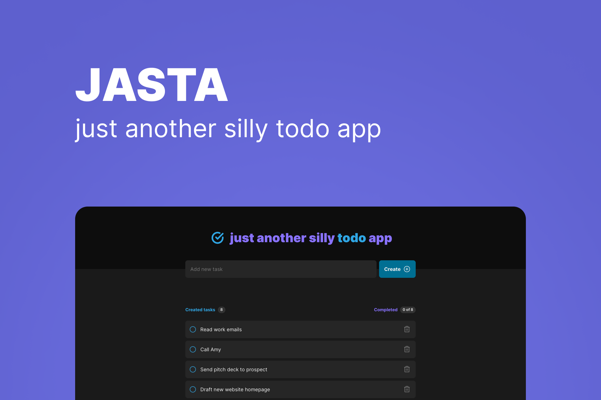

# JASTA - just another silly todo app ✅

JASTA (as you can realize) is a todo-list app (yeah great idea, I know) created just for test my knowledge in React.

## What was used? 🧐

- React
- TypeScript
- styled-components (first time using on web, works better than in React Native IMO)

## FF (Future Features) 🔮

- Responsiveness 📱
- Edit your tasks (it's not possible yet, my bad 🫤)
- Login/Auth using [Firebase](https://firebase.google.com/) (currently only saves to localStorage)
- Internationalization using [react-i18next](https://react.i18next.com/)

---

And that's all folks! 🐷
